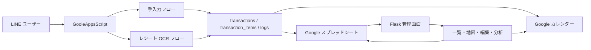

# HouseholdAccount

HouseholdAccount は、家計簿を「金額の記録」だけで終わらせず、

- いつ使ったか
- どこで使ったか
- 何を買ったか
- 後からどう直したか

まで一貫して管理するためのプロジェクトです。

LINE、Google Apps Script、Google スプレッドシート、Google カレンダー、Flask をつなぎ、一般利用者の入力体験と運用者の修正体験を同じ土台で扱えるようにしています。

ご相談文中の「OCM」は文脈上 `OCR` の意味として解釈し、本リポジトリでは OCR として設計しています。

---

## このリポジトリでできること

現在の本体は、`GooleAppsScript/` と `Flask/` です。  
旧バージョンのディレクトリは整理し、今読むべきコードが分かりやすい状態にしています。

### 利用者向け

- LINE で金額を送って手入力できる
- LINE でレシート画像を送って OCR 登録できる
- 支出内容を Google カレンダーにも残せる

### 運用者向け

- スプレッドシートに共通スキーマで保存できる
- Flask 画面で一覧、地図、編集、監査ログ、分析を見られる
- 日付や店舗名やカテゴリを後から修正できる
- 修正結果を Google カレンダー再同期につなげられる

### 分析向け

- 月別支出
- カテゴリ別支出
- 住所未解決データの洗い出し
- 地点付き支出の確認
- 家庭バランスシートとの併用

---

## 処理の流れ

HouseholdAccount は、次の流れで動きます。

1. ユーザーが LINE でメッセージを送る
2. `GooleAppsScript/webapp.js` が Webhook を受け取る
3. 手入力かレシート OCR かを自動判定する
4. 正規化した取引データをスプレッドシートへ保存する
5. 必要なら Google カレンダーへ支出イベントを登録する
6. `Flask` がそのデータを一覧や地図として表示する
7. 運用者が Flask から内容を修正する
8. 修正内容を監査ログへ残し、必要に応じて再同期する



---

## フォルダ構成

| パス | 役割 |
|---|---|
| `GooleAppsScript/` | LINE Webhook、OCR、保存、カレンダー同期、管理 API |
| `Flask/` | 地図・一覧・編集・分析・家庭バランスシート |
| `docs/` | 要件定義と設計書 |
| `images/` | README 用の補助画像 |
| `memo/` | 途中メモ、補助的な検討資料 |

---

## GooleAppsScript の読み方

`GooleAppsScript/` は、入力と保存の中心です。

| ファイル | 役割 |
|---|---|
| `webapp.js` | `doGet` / `doPost` の入口。LINE Webhook と管理 API の分岐もここで行う |
| `manual_flow.js` | 金額入力からカテゴリ選択、位置登録までの LINE 手入力フロー |
| `receipt_flow.js` | レシート画像の受信、OCR、保存、返信 |
| `repository.js` | スプレッドシートへの書き込み・更新・監査ログ保存 |
| `integrations.js` | LINE、Gemini OCR、Geocode、Google カレンダーとの連携 |
| `category_master.js` | カテゴリ定義 |
| `config.js` | シートヘッダー、設定値、共通関数 |

### GooleAppsScript の役割を一言で言うと

「LINE から届いた入力を、壊れにくい共通データにして保存する場所」です。

---

## Flask の読み方

`Flask/` は、見える管理画面です。

| ファイル | 役割 |
|---|---|
| `app.py` | Flask のルーティング。画面表示と API をまとめる |
| `store.py` | GAS 連携モードとローカル JSON モードの切り替えを担当 |
| `templates/index.html` | 地図、一覧、編集、監査ログ、分析をまとめたメイン画面 |
| `templates/balance_sheet.html` | 家庭バランスシート画面 |
| `data/transactions.json` | ローカルデモ用の取引データ |
| `data/audit_logs.json` | ローカルデモ用の監査ログ |
| `data/balance_sheet_snapshots.json` | バランスシートの保存先 |

### Flask の役割を一言で言うと

「保存されたデータを、人が見て直して活用する場所」です。

---

## スプレッドシートのシート構成

`GooleAppsScript` では、Google スプレッドシートに次のシートを使います。

| シート名 | 用途 |
|---|---|
| `transactions` | 1取引1行の台帳 |
| `transaction_items` | レシート明細 |
| `system_logs` | 処理ログ |
| `audit_logs` | 編集履歴 |
| `calendar_sync_logs` | Google カレンダー同期履歴 |
| `user_status` | LINE 手入力の途中状態 |
| `processed_events` | LINE Webhook の重複受信管理 |
| `setting` | 各種トークンや外部連携設定 |

### `transactions` に入る主な情報

- `transaction_id`
- `event_id`
- `user_id`
- `input_channel`
- `status`
- `date`
- `time`
- `amount_total`
- `store_name`
- `store_address`
- `lat`
- `lon`
- `category_main`
- `category_sub`
- `category_detail`
- `payment_method`
- `source_message`
- `calendar_event_id`
- `created_at`
- `updated_at`

---

## セットアップ手順

### 1. Google スプレッドシートを作る

HouseholdAccount 用のスプレッドシートを 1 つ作り、Apps Script を紐づけます。  
必要なシートは基本的にコード側で自動生成される前提です。

### 2. `setting` シートを作る

`A列=キー`、`B列=値` の形式で設定します。

| キー | 内容 |
|---|---|
| `line_channel_access_token` | LINE Messaging API のアクセストークン |
| `gemini_api_key` | OCR 解析に使う Gemini API キー |
| `receipt_drive_folder_id` | レシート画像保存用 Google Drive フォルダ ID |
| `calendar_id` | Google カレンダー ID |
| `admin_token` | Flask から更新 API を叩くときの認証トークン |

### 3. GooleAppsScript を Web アプリとしてデプロイする

- 実行ユーザーを設定する
- アクセス権を設定する
- 発行された URL を LINE Webhook 用に使う

### 4. LINE Developers に Webhook URL を設定する

LINE から `GooleAppsScript` にイベントが飛ぶように設定します。

### 5. Flask を起動する

```bash
cd Flask
python3 -m venv .venv
source .venv/bin/activate
pip install -r requirements.txt
python3 app.py
```

### 6. Flask と GAS を接続する

必要に応じて次の環境変数を設定します。

| 環境変数 | 役割 |
|---|---|
| `GAS_WEBAPP_URL` | GooleAppsScript の Web アプリ URL |
| `GAS_ADMIN_TOKEN` | 管理 API 用トークン |
| `FLASK_DEBUG` | Flask デバッグ起動切り替え |

`GAS_WEBAPP_URL` を設定しない場合でも、`Flask/data/transactions.json` を使ってローカルデモとして動かせます。

---

## 画面上で何ができるか

### `/`

- 取引の一覧表示
- 地図表示
- 日付やカテゴリでの絞り込み
- 取引内容の編集
- 監査ログの確認
- 月別支出の可視化
- 要確認データの洗い出し

### `/balance-sheet`

- 資産と負債の入力
- 純資産の自動計算
- 支出データを踏まえた改善提案の表示

---

## 修正するとどう反映されるか

1. Flask で対象取引を開く
2. 日付、店舗、住所、カテゴリ、明細などを直す
3. Flask が GooleAppsScript の管理 API を呼ぶ
4. スプレッドシートの台帳を更新する
5. 監査ログに変更前後を残す
6. `confirmed` の取引で必要なものは Google カレンダーを更新する

つまり、「画面だけ直って裏のデータが古いまま」という状態を防ぐ設計にしています。

---

## 初見の方におすすめの読み順

1. この `README.md`
2. `docs/v3_architecture.md`
3. `GooleAppsScript/README.md`
4. `Flask/README.md`
5. `docs/v3_requirements.md`

---

## 関連ドキュメント

- `docs/v3_architecture.md`: システム全体の責務分担
- `docs/v3_requirements.md`: 詳細要件
- `docs/v3_balance_sheet_feature.md`: 家庭バランスシート機能の補足

